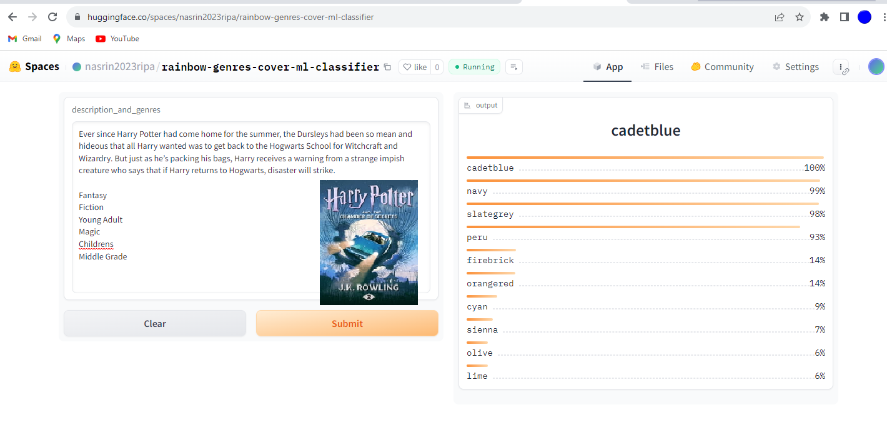

# Multilabel-Book-Genre-Cover-Hues

A text classification model from data collection, model training, and deployment.  
The model can classify 58 book cover colors for 7575 numbers of different book genres  The keys of `deployment\color_types_encoded50.json` shows the book cover colors for top 10 genres of each book.

 ## Data Collection

Data was collected from the Website: https://www.smashwords.com  
The data collection process is divided into 2 steps:

1. **Book URL Scraping:** The book urls were scraped with `scraper\book_url_scraper.py` and the urls are stored along with book title in `scraper\book_urls.csv`
2. **Book Details Scraping:** Using the urls, book description and genres are scraped with `scraper\book_details_scraper.py` and they are stored in `data\book_detils.csv`

In total, I scraped 21200+ book details

## Data Preprocessing

Initially there were *640* different genres in the dataset. After some analysis, I found out *499* of them are rare (probably custom genres by users). So, I removed those genres and then I have *141* genres. After that, I removed the description without any genres resulting in *6,104* samples.

## Model Training

Finetuned a `distilrobera-base` model from HuggingFace Transformers using Fastai and Blurr. The model training notebook can be viewed [here](https://github.com/msi1427/MultiLabel-Book-Genre-Classifier/blob/main/notebooks/multilabel_text_classification.ipynb)

## Model Compression and ONNX Inference

The trained model has a memory of 300+MB. I compressed this model using ONNX quantization and brought it under 80MB. 

## Model Deployment

The compressed model is deployed to HuggingFace Spaces Gradio App. The implementation can be found in `deployment` folder or [here](https://huggingface.co/spaces/msideadman/multilabel-book-genre-classifier) 

## Web Deployment
Deployed a Flask App built to take descprition and show the genres as output. Check `flask ` branch. The website is live [here](https://multilabel-book-genre-classifier.onrender.com) 

