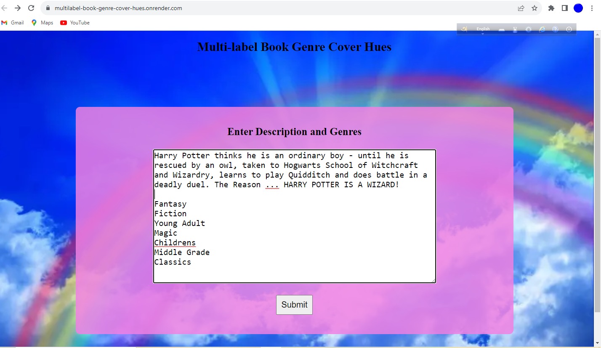
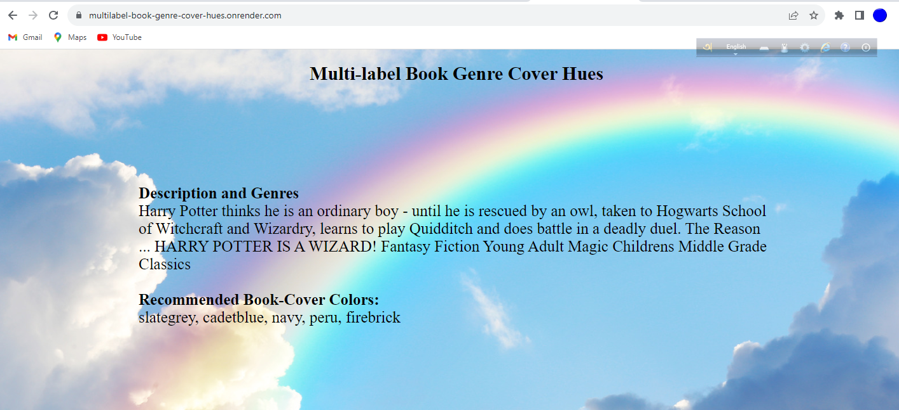

# Multilabel Book Genre Cover Hues 🌈

Welcome to the Multilabel Book Genre Cover Hues repository! This project encompasses a comprehensive text classification model pipeline, including data collection, model training, deployment, and user-friendly web interfaces for predicting book cover colors based on different genres.

## Introduction

The main objective of this project is to develop a robust text classification model capable of associating 58 distinct book cover colors with an extensive array of 7575 diverse book genres. The keys within the `deployment\color_types_encoded50.json` provide insights into the top 10 genres for each book, revealing the corresponding book cover colors.

## Data Collection

The primary dataset was sourced from the esteemed website [Smashwords](https://www.smashwords.com). The data collection phase involved three key steps:

1. **Book URL Scraping:** Book URLs were systematically gathered using the `scraper\smashbook_title_urls.py` script. The URLs, along with their corresponding book titles, were stored in `scraper\smashbook_urls_1001.csv` and `scraper\smashbook_urls_2001.csv`.

2. **Book Details Scraping:** Leveraging the acquired URLs, comprehensive book descriptions and genres were extracted using the `scraper\smashbook_details.py` script. The collected data was then saved in `scraper\smashbook_detils1.csv` and `scraper\smashbook_detils_2.csv`.

3. **Data Integration:** The two CSV files, namely `smashbook_details1.csv` and `smashbook_details_2.csv`, were intelligently merged using the Python script in `scraper/joining.py`, resulting in the consolidated `scraper/book_details_merged_tables.csv`.

In total, over 21200 meticulously curated book details were collected.

## Data Preprocessing

The data preprocessing phase involved two key tasks:

1. **Genre Categorization:** An innovative data cleaning process was executed, resulting in the identification of the top 10 genres for each book title. This transformation was achieved using the script `scraper/cleaned_book_detail_with_top10genres.py`, with the resulting data stored in `scraper/book-details_10common_genres.csv`.

2. **Color Assignment:** The subsequent task was the allocation of colors to the top 10 genres for each title. The script `scraper/assigning_colors_for_top10genres.py` facilitated this process, leading to the creation of `data/book_details_with_50colors.csv`.

## Model Training

The model training phase revolved around fine-tuning a `distilrobera-base` model from the HuggingFace Transformers library, utilizing the Fastai and Blurr frameworks. A detailed account of this process is provided in the [model training notebook](https://github.com/NasrinRipa/Multilabel-Book-Genre-Cover-Hues/blob/main/notebooks/multilabel_text_classification.ipynb).

## Model Compression and ONNX Inference

The resultant trained model had a substantial memory footprint. To address this concern, the ONNX quantization technique was employed to compress the model's memory usage to a modest 80MB. The process is provided in the [ONNX inference notebook](https://github.com/NasrinRipa/Multilabel-Book-Genre-Cover-Hues/blob/main/notebooks/onnx_inference.ipynb)

## Model Deployment

The compressed model is seamlessly accessible through the HuggingFace Spaces Gradio App. Detailed implementation specifics can be found in the `deployment` folder or directly via this [link](https://huggingface.co/spaces/nasrin2023ripa/rainbow-genres-cover-ml-classifier).

## Web Deployment

An intuitive Flask application was meticulously developed, allowing users to input book descriptions and genres to receive recommended book-cover colors as output. The live application can be accessed through this [link](https://multilabel-book-genre-cover-hues.onrender.com/).

## Application

Experience the innovation of our multi-label text classifier model, meticulously designed to provide insightful suggestions for book cover colors. Drawing inspiration from book descriptions (both with and without titles) and genres, this advanced model demonstrates its prowess by recommending an intricate palette of cover hues. Notably, the predicted set of 10 colors goes beyond conventional suggestions, offering the added benefit of generating a captivating multi-color Barcode for the book. Here, the prediction percentages intricately define the width of the bars, presenting an artistic representation of the book's essence. Unleash the potential of our model to infuse vibrant shades and imaginative storytelling into your literary world.

## Acknowledgments

Heartfelt gratitude is extended to Mohammad Sabik Irbaz and MasterCourse Bangladesh for their pivotal contributions in steering this capstone project. Their expertise, guidance, and unwavering support were crucial in shaping my skills and ensuring the successful completion of this repository. I am sincerely appreciative of their mentorship throughout this transformative journey.
